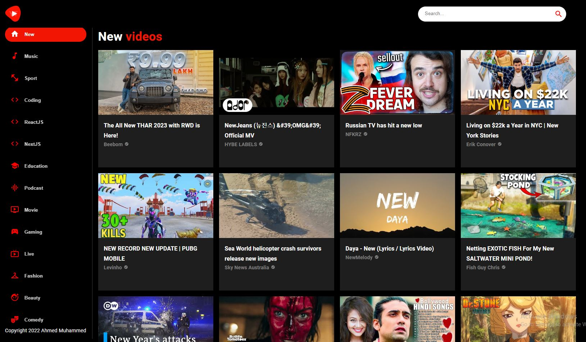

# VideoVault

VideoVault is a YouTube Clone made using the YouTube V3 API from RapidApi. 
Link to Live site: https://videovault.netlify.app/


## Installation

```bash
npm i
```

## Usage

- Runs the app in the development mode.
- Open [http://localhost:3000](http://localhost:3000) to view it in your browser.

```bash
npm start
```

## Built With


